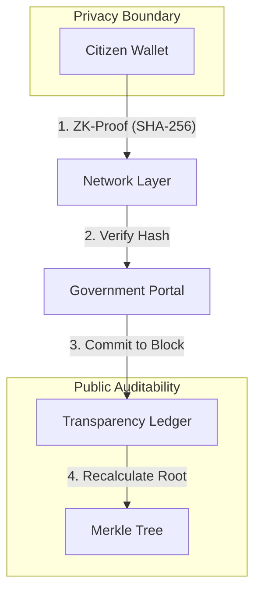

# 🛡️ GovTrust-Connect (TrustLink-ZK)

> **Decentralized Zero-Knowledge Governance Framework**  
> *Providing 100% data privacy for citizens while maintaining absolute cryptographic truth for governments.*

---

## 🏛️ Project Overview

**GovTrust-Connect** is a high-fidelity prototype of a "Neo-Governmental" infrastructure. Built on the principles of **Zero-Knowledge (ZK) Cryptography**, it enables citizens to prove facts about themselves (e.g., "I am over 18", "My income is within this bracket") to government authorities without sharing a single byte of their actual raw personal data.

### The Problem
Traditional identity verification requires sharing sensitive documents (Passports, Tax Returns) which leads to data leaks and centralized points of failure.

### The Solution: "Verify, Don't Trust"
Using simulated ZK-Proofs, GovTrust-Connect shifts the paradigm. The citizen's device generates a cryptographic proof of fact; the government verifier simply confirms the proof's validity against a distributed ledger.

---

## 🚀 Core Features

### 1. 🧤 Citizen Wallet (The 'Guardian' App)
- **Granular Consent**: Toggle exactly what information enters the ZK-Proof generation.
- **On-Device Proof Generation**: Simulated "SNARK" construction with technical logs.
- **Attack Simulation**: Includes a "Malicious Prover" mode to test system integrity against MITM attacks or proof tampering.

### 2. 🏢 Government Verifier Portal
- **Verification Sequence**: A "Lattice Animated" verification flow that validates incoming proof hashes in real-time.
- **Fraud Detection**: Instant blocking of malformed or tampered hashes with system-wide fraud alerts.
- **Request Console**: Direct broadcast of verification requests to the citizen network.

### 3. 📜 Transparency Ledger (Audit View)
- **Merkle Tree Visualizer**: A live-animating Merkle Tree that hierarchically hashes the latest transactions into a single "State Root."
- **Immutable Audit Log**: Transparent, post-quantum secure log of all network activity.
- **Consensus Activity**: Visual track of lattice entropy and block heights.

---

## 🛠️ Technology Stack

| Layer | Technology |
| :--- | :--- |
| **Frontend** | React 18, Vite |
| **Styling** | Vanilla CSS, Neo-Governmental Design System (Glassmorphism) |
| **Animations** | Framer Motion |
| **Icons** | Lucide React |
| **Backend** | FastAPI (Python 3.10+) |
| **Database** | In-Memory Immutable Ledger Simulation |

---

## 📐 System Architecture



---

## 📥 Getting Started

### Prerequisites
- **Node.js** (v18+)
- **Python** (v3.10+)

### 1. Backend Setup
```bash
cd backend
python -m venv venv
# Activate venv: (Windows: venv\Scripts\activate | Unix: source venv/bin/activate)
pip install -r requirements.txt # (FastAPI, uvicorn, pydantic)
python main.py
```

### 2. Frontend Setup
```bash
cd frontend
npm install
npm run dev
```

---

## 🛡️ Security Implementation Note

This prototype simulates a **Zero-Knowledge Proof** environment. While the current implementation uses SHA-256 and UUID-based cryptographic simulations for speed and UI fidelity, the logic maps directly to authentic ZK-SNARK/STARK workflows where the **Witness** is never shared with the **Verifier**.

---

*Developed for the Next Generation of Trustless Governance.*